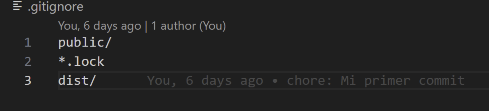

# Practica 0: Uso de repositorios

## **Introducción**

Esta práctica está dividida en tres secciones, en cada una de ellas se realizó algo diferente, pero que de igual forma complementa lo que es la implementación de repositorios y la implementación de Hugo para generar páginas estáticas.

## **Primera sesión: Sintaxis y uso de markdown**

En la primera sesión se nos mostró de forma rápida las primeras herramientas que íbamos a utilizar durante el semestre. Estas fueron Hugo y Markdown, pero en esta sesión fue más que nada para aprender a usar markdown y descubrir las opciones que ofrecían, entre ellas está:

* Como poner diferentes tamaños de encabezado
* Como poner un texto en itálicas, negritas y rayado
* Como crear una lista
* Cómo insertar imágenes, ya sea por medio de un archivo de la computadora o desde un link externo a internet. Al igual que configurar si tamaño
* Cómo insertar un bloques de código
* Como insertar tablas
* Cómo insertar casillas

## **Segunda sesión: Uso de Git y Github**

En esta sesión se realizó la instalaciones de los Git y Gitlab necesarios para crear un repositorio en GitHub. Además de instalar los programas fue necesario realizar una serie de comandos para la correcta configuración del repositorio.

Una vez creado el repositorio se nos enseñó la serie de comandos en Gitbash, ya que es importante empezar a familiarizarse con la terminal para trabajar, resumidamente fueron comandos para moverse a través de las carpetas de la computadora, crear archivos, borrar archivos, y comandos para subir archivos al repositorio.

Un tip fue crear un archivo .gitignore para que al momento de querer subir o actualizar los archivos sean ignorados. Esto puede ser útil principalmente para que no sean útiles o necesarios, como los ejecutables de un código compilado como C.

## **Tercera sesión: Combinar los conocimientos de Markdown y Git para generar páginas estáticas con Hugo y Github**

Una vez creado el repositorio fue necesario instalar e instalado Gitlab, se realizó la instalación y configuración de Hugo, el medio por el cual vamos a generar el sitio web donde se estará mostrando el contenido que se haya creado en el archivo markdown guardado en la computadora y respaldado en el repositorio de Github.

Para iniciar la página es necesario el comando hugo serve

Y para detenerlo se debe usar el control + c.

- Evidencia de la pagina creada:
