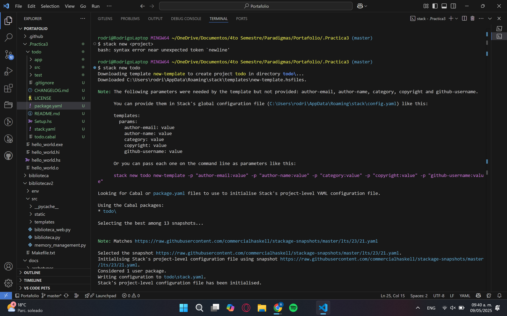

# Práctica 3: Funcionamiento de Haskell

## **Introducción**

En esta práctica se van a seguir los pasos de un blog para aprender a crear una aplicación de tareas pendientes con Haskell y Stack.

## 

## - Proceso al crear la aplicacion

### **1. Iniciar el entorno de desarrollo de Haskell con Stack**

#### **Utilizar el comando `$ stack new todo`**

  


#### **Verificar la creación de los archivos con `$ ls todo`**


#### **Modificar el archivo package.yaml**

Agregar esto a dependencies:
-dotenv
-open-browser


#### **Primer uso de `$ stack test`**


#### **Primer uso de `$ stack run`**


Se puede observar que el proyecto se construyo y compilo en la consola

### **2. Escribir la aplicación Todo con Haskell**

#### **Editar el archivo `Main.hs`**


Los putStrLn sirve para mostrar que comandos se pueden usar en la aplicacion de tareas pendientes.

La parte logica principal se manejara con prompt una parte y se importara desde el archivo Lib.sh

#### **Editar el archivo `Lib.hs`**


#### **Ejecutar nuevamente `$ stack run`**

Prueba para observar la aplicacion de tareas pendientes de Haskel.


#### **Incluir una tarea pendiente**


#### **Editar el archivo `Spec.hs`**


#### **Ejecutar el comando `$ stack test` nuevamente**


### **3. Aprender a usar los paquetes de Haskell**

#### **Crear un archivo `.env`**

#### **Actualizar el archivo `Main.hs`**


#### **Ejecutar nuevamente**


## - Funcionamiento de la aplicacion de Haskell

### **Codigos en configuracion del enterono**

#### **package.yaml**
```yaml
dependencies:
- base >= 4.7 && < 5 # Paquete base del sistema
- dotenv   # Para cargar variables de entorno desde .env
- open-browser # Para abrir el navegador desde el cdigo
```

### **Codigo en la aplicacion Todo**

#### **Main.hs**

```Haskell
-- Punto de entrada del programa principal
module Main where

-- Importar la funcion 'prompt' desde el módulo Lib
import Lib (prompt)

-- Funcion principal del programa
main :: IO ()
main = do    
    -- Mostrar al usuario los comandos disponibles
    putStrLn "Commands:"
    putStrLn "+ <String> - Add a TODO entry"   -- Agregar una entrada nueva al TODO
    putStrLn "- <Int>    - Delete the numbered entry"  -- Eliminar una entrada por numero
    putStrLn "s <Int>    - Show the numbered entry"    -- Mostrar una entrada especifica
    putStrLn "e <Int>    - Edit the numbered entry"    -- Editar una entrada especifica
    putStrLn "l          - List todo"    -- Listar todas las entradas TODO
    putStrLn "r          - Reverse todo" -- Revertir el orden de la lista
    putStrLn "c          - Clear todo"   -- Borrar toda la lista
    putStrLn "q          - Quit"         -- Salir del programa
    prompt [] -- Llamar a 'prompt' con una lista vacia para iniciar el ciclo de comandos

```

#### **Lib.hs**
```Haskell
-- Modulo Lib define funciones auxiliares para manejar la lista de TODOs.
module Lib
  ( prompt,       -- Funcion principal para interactuar con el usuario
    editIndex     -- Permite editar un elemento de la lista en un indice dado
  )
where

import Data.List  -- Importar utilidades de listas, como 'isPrefixOf'

-- import Data.Char (digitToInt)  

-- Muestra una entrada TODO con su numero de indice
putTodo :: (Int, String) -> IO ()
putTodo (n, todo) = putStrLn (show n ++ ": " ++ todo)

-- Funcion principal que interpreta los comandos del usuario
prompt :: [String] -> IO ()
prompt todos = do
  putStrLn ""
  putStrLn "Test todo with Haskell. You can use +(create), -(delete), s(show), e(dit), l(ist), r(everse), c(lear), q(uit) commands."
  command <- getLine
  if "e" `isPrefixOf` command  -- Si el comando comienza con 'e', editar
    then do
      print "What is the new todo for that?"
      newTodo <- getLine
      editTodo command todos newTodo
    else interpret command todos  -- Para otros comandos, usar interpret

-- Interpreta los distintos comandos del usuario
interpret :: String -> [String] -> IO ()
interpret ('+' : ' ' : todo) todos = prompt (todo : todos)  -- Agregar un nuevo TODO al principio

interpret ('-' : ' ' : num) todos =
  case deleteOne (read num) todos of  -- Eliminar el TODO en la posicion dada
    Nothing -> do
      putStrLn "No TODO entry matches the given number"
      prompt todos
    Just todos' -> prompt todos'

interpret ('s' : ' ' : num) todos =  -- Mostrar una entrada especifica
  case showOne (read num) todos of
    Nothing -> do
      putStrLn "No TODO entry matches the given number"
      prompt todos
    Just todo -> do
      print $ num ++ ". " ++ todo
      prompt todos

interpret "l" todos = do  -- Listar todos los TODOs
  let numberOfTodos = length todos
  putStrLn ""
  print $ show numberOfTodos ++ " in total"
  mapM_ putTodo (zip [0 ..] todos)
  prompt todos

interpret "r" todos = do  -- Revertir el orden de la lista
  let numberOfTodos = length todos
  putStrLn ""
  print $ show numberOfTodos ++ " in total"
  let reversedTodos = reverseTodos todos
  mapM_ putTodo (zip [0 ..] reversedTodos)
  prompt todos

interpret "c" todos = do  -- Limpiar la lista TODO
  print "Clear todo list."
  prompt []

interpret "q" todos = return ()  -- Salir del programa

interpret command todos = do  -- Comando invalido
  putStrLn ("Invalid command: `" ++ command ++ "`")
  prompt todos

-- Elimina una entrada TODO en una posicion especifica
deleteOne :: Int -> [a] -> Maybe [a]
deleteOne 0 (_ : as) = Just as
deleteOne n (a : as) = do
  as' <- deleteOne (n - 1) as
  return (a : as')
deleteOne _ [] = Nothing

-- Muestra una entrada TODO si existe
showOne :: Int -> [a] -> Maybe a
showOne n todos =
  if (n < 0) || (n > length todos)
    then Nothing
    else Just (todos !! n)

-- Reemplaza el elemento en el indice dado con uno nuevo
editIndex :: Int -> a -> [a] -> [a]
editIndex i x xs = take i xs ++ [x] ++ drop (i + 1) xs

-- Logica para editar una entrada TODO
editTodo :: String -> [String] -> String -> IO ()
editTodo ('e' : ' ' : num) todos newTodo =
  case editOne (read num) todos newTodo of
    Nothing -> do
      putStrLn "No TODO entry matches the given number"
      prompt todos
    Just todo -> do
      putStrLn ""
      print $ "Old todo is " ++ todo
      print $ "New todo is " ++ newTodo

      let newTodos = editIndex (read num :: Int) newTodo todos
      let numberOfTodos = length newTodos
      putStrLn ""
      print $ show numberOfTodos ++ " in total"
      mapM_ putTodo (zip [0 ..] newTodos)
      prompt newTodos

-- Devuelve la entrada antigua antes de editar, si existe
editOne :: Int -> [a] -> String -> Maybe a
editOne n todos newTodo =
  if (n < 0) || (n > length todos)
    then Nothing
    else Just (todos !! n)

-- Invierte el orden de una lista
reverseTodos :: [a] -> [a]
reverseTodos xs = go xs []
  where
    go :: [a] -> [a] -> [a]
    go [] ys = ys
    go (x : xs) ys = go xs (x : ys)
```

#### **Spec.hs**

```Haskell
-- Importa el modulo para manejar aserciones y excepciones
import Control.Exception 

-- Importa la función editIndex desde el módulo Lib
import Lib (editIndex)

-- Funcion principal
main :: IO ()
main = do
    putStrLn "Test:"  -- Mensaje inicial para el usuario

    -- Datos de prueba
    let index = 1          -- Indice que queremos editar
    let new_todo = "two"   -- Nuevo valor que queremos poner en la lista
    let todos = ["Write", "a", "blog", "post"]         -- Lista original
    let new_todos = ["Write", "two", "blog", "post"]   -- Lista esperada después de la edición

    -- Comparamos el resultado de aplicar 'editIndex' con la lista esperada
    let result = editIndex index new_todo todos == new_todos

    -- assert :: Bool -> a -> a
    -- Si 'result' es False, lanza una excepcion. Si es True, imprime el mensaje
    putStrLn $ assert result "editIndex worked."  
```

### **Codigo en aprender a usar los paquetes en haskell**

#### **Main.hs**

```Haskell
-- Enlace al tutorial oficial sobre Stack Script
-- https://www.fpcomplete.com/haskell/tutorial/stack-script/

-- Estas líneas son necesarias para que el archivo funcione como script ejecutable en Unix
-- #!/usr/local/bin/env stack
-- stack --resolver lts-12.21 script

-- Modulo principal del programa
module Main where

-- Importar dotenv para cargar variables desde un archivo .env
import Configuration.Dotenv (defaultConfig, loadFile)

-- Importar la funcion prompt desde nuestro módulo Lib
import Lib (prompt)

-- Importar lookupEnv para obtener variables de entorno
import System.Environment (lookupEnv)

-- Importar openBrowser para abrir URLs en el navegador predeterminado
import Web.Browser (openBrowser)

-- $stack run
-- $stack build
-- $stack install
-- $stack install --local-bin-path <dir>
-- $stack install --local-bin-path .
-- $./text-exe
-- $stack Main.hs
-- $chmod +x Main.hs
-- $./Main.hs

-- Comentario aclaratorio: este script requiere .env y puede abrir un navegador.

-- Función principal
main :: IO ()
main = do
  -- Carga las variables de entorno desde el archivo .env
  loadFile defaultConfig

  -- Busca la variable WEBSITE en el entorno
  website <- lookupEnv "WEBSITE"

  -- Verifica si la variable WEBSITE esta definida
  case website of
    Nothing -> error "You should set WEBSITE at .env file."  -- Error si no esta definida
    Just s -> do
      -- Intenta abrir la URL en el navegador predeterminado
      result <- openBrowser s
      if result
        then print ("Could open " ++ s)     -- Confirmación de exito
        else print ("Couldn't open " ++ s)  -- Mensaje de error si falla

      -- Muestra los comandos disponibles al usuario
      putStrLn "Commands:"
      putStrLn "+ <String> - Add a TODO entry"
      putStrLn "- <Int>    - Delete the numbered entry"
      putStrLn "s <Int>    - Show the numbered entry"
      putStrLn "e <Int>    - Edit the numbered entry"
      putStrLn "l          - List todo"
      putStrLn "r          - Reverse todo"
      putStrLn "c          - Clear todo"
      putStrLn "q          - Quit"
      prompt []  -- Inicia el bucle de interaccion con una lista vacia

-- putStrLn "Commands:"
-- putStrLn "+ <String> - Add a TODO entry"
-- putStrLn "- <Int>    - Delete the numbered entry"
-- putStrLn "s <Int>    - Show the numbered entry"
-- putStrLn "e <Int>    - Edit the numbered entry"
-- putStrLn "l          - List todo"
-- putStrLn "r          - Reverse todo"
-- putStrLn "c          - Clear todo"
-- putStrLn "q          - Quit"
-- prompt [] -- Start with the empty todo list.
```