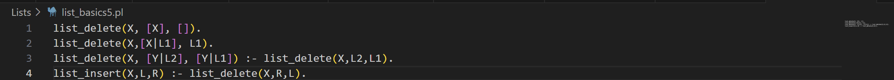
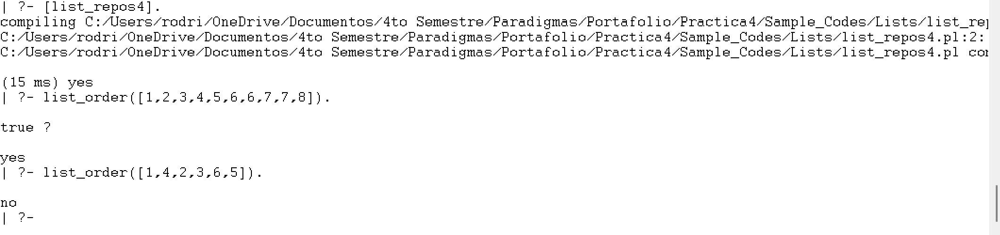
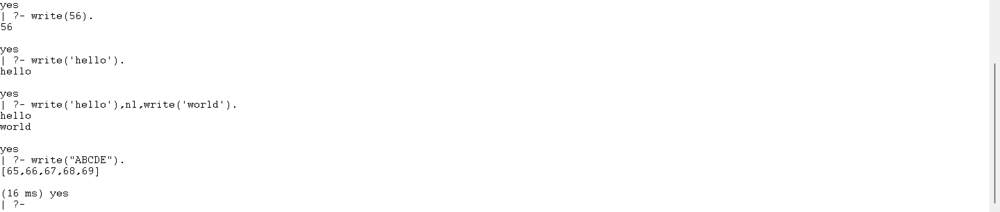

# Práctica 4: Paradigma logico

## **Introducción**

Prolog o PROgramming en LOG, es un lenguaje de programación lógico y declarativo.

Funciona más como una base de conocimientos donde dices que cosas son verdaderas y cómo se relacionan. Esto permite responder preguntas preguntas haciendo una
búsqueda (consultando) en una base de hechos y reglas para deducir una respuesta (si es que se puede).

El lenguaje Prolog tiene tres elementos diferentes:

Hechos: El hecho es un predicado que es verdadero.

Reglas: Las reglas son extinciones de hechos que contienen cláusulas condicionales. Para satisfacer una regla, estas condiciones deben cumplirse

Preguntas: Para ejecutar un programa prolog preguntas, estas preguntas pueden responderse mediante los hechos y las reglas dadas.

## **Descarga de GNU Prolog**

Primero se descarga el archivo .exe para iniciar la instalación de GNU Prolog

  

## **Hello world**

Después se realizará una prueba en el programa GNU donde se va a escribir "Hello World"

  

Posteriormente se cambiará el directorio a la carpeta donde vayamos a crear y guardar los códigos, en este caso si usara el mismo nombre que en el tutorial

  

Se crea un archivo con la extensión  ".pl"

Y se corre poniendo el nombre del archivo entre corchetes

## **Basics**

En este capítulo se cubrirán los siguientes temas

### **Hechos, reglas y consultas**

Se puede definir un hecho como una relación explícita entre objetos y las propiedades que estos pueden tener, por lo tanto lo hechos son incondicionalmente verdaderos.

Por otro lado, las normas se pueden definir como una regla o como una relación implícita entre objetos, por lo tanto son condicionalmente verdaderos.

Las consultas son preguntas sobre las relaciones entre objetos y sus propiedades. La pregunta puede ser cualquier cosa.

### **Base de conocimientos**

Al recopilar los puntos anteriores (hechos, reglas y consultas) se forma una base de conocimiento. Así que se podría decir que una base de conocimiento es un conjunto de hechos y reglas. 

A continuación se presentan tres ejemplos de bases de conocimiento

#### **Knowledge Base 1**

#### **Knowledge Base 2**

#### **Knowledge Base 3**

## **Relations**

Las relaciones pueden expresarse mediante hechos y reglas. Existen varios tipos de relaciones, algunas pueden ser también reglas.

### **Relación familiar**

Este es un ejemplo de una relación compleja que se puede formar en Prolog, basado en el siguiente árbol genealógico

Se mapeara en Prolog mediante hecho y reglas, el cual es el siguiente

Ahora se agregaran mas extensiones, donde se crearán relaciones de abuelos

### **Recursion de las relaciones familiares**

También se pueden crear relaciones recursivas

## **Data objects**

Los objetos de datos en Prolog se dividen en varias partes

### **Atoms**

Los átomos son una variante de las constantes, estas pueden ser cualquier nombre u objeto.

### **Anonymous Variables**

Las variables anónimas no tienen nombre, se escriben con un guión bajo ('_'). Cada variable anónima son diferentes.

## **Operators**

### **Comparison operators**

Se utilizan para comparar dos ecuaciones o estados, por ejemplo:

| Operator  | Meaning                           |
|-----------|-----------------------------------|
| X > Y     | X is greater than Y               |
| X < Y     | X is less than Y                  |
| X >= Y    | X is greater than or equal to Y   |
| X =< Y    | X is less than or equal to Y      |
| X =:= Y   | the X and Y values are equal      |
| X =\= Y   | the X and Y values are not equal  |

### **Arithmetic Operators**

Se utilizan para realizar operaciones aritméticas

| Operator | Meaning           |
|----------|-------------------|
| +        | Addition          |
| -        | Subtraction       |
| *        | Multiplication    |
| /        | Division          |
| **       | Power             |
| //       | Integer Division  |
| mod      | Modulus           |

## **Loop & Decision Making**

### **Loops**

Se utilizan para ejecutar el bloque de código varias veces mediante logica de predicados recursiva, ejemplo:

Ahora un ejemplo de un bucle que tome los valores minimo y maximo utilizando between()

### **Decision Making**

Son sentencias de decisión If-Then-Else. Cuando se cumpla una condición de realizará una tarea

## **Conjunctions & Disjunctions**\

### **Conjuction**

La conjunción (lógica AND) se puede implementar mediante el operador coma. De esta forma los predicados separados por coma se unen con la instrucción AND.

### **Disjunction**

La disyunción (lógica OR) se puede implementar mediante el operador punto y coma. De esta forma, dos predicados separados por punto y coma se unen mediante la instrucción OR.

## **Lists**

Las listas son una estructura de datos que puede utilizarse en diversos casos de programación no numérica. Se utilizan para almacenar átomos como una colección

### **Representation of Lists**

Para representar una estructura los elementos se encierra entre corchetes, cada elemento se separa por comas. 

El primer elemento de la lista se llamada cabecera de la lista, y la parte restante se llamada cola

### **Basics Operations on Lists**

| Operations           | Definition                                                                 |
|----------------------|----------------------------------------------------------------------------|
| Membership Checking  | Esta operación verifica si un elemento dado es miembro de una lista específica. |
| Length Calculation   | Con esta operación, podemos encontrar la longitud de una lista.            |
| Concatenation        | Operación que se utiliza para unir o agregar dos listas.                   |
| Delete Items         | Esta operación elimina el elemento especificado de una lista.              |
| Append Items         | La operación de agregar añade una lista dentro de otra (como un elemento). |
| Insert Items         | Esta operación inserta un elemento dado en una lista.                      |
  

### **Membership Operation**

Podemos comprobar si un miembro X está presente en la lista

##3 **Lenght Calculation**

Se utiliza para hallar la longitud de la lista

Ejemplo:

Supongamos que el nombre del predicado es list_length(L,N) . Este usa L y N como argumentos de entrada. Esto contará los elementos de una lista L e instancia N con su número. Al igual que en nuestras relaciones anteriores con listas, conviene considerar dos casos:

Si la lista está vacía, entonces la longitud es 0.

Si la lista no está vacía, entonces L = [Cabeza|Cola], luego su longitud es 1 + longitud de Cola.

### **Concatenation**

La concatenación de dos lista implica sumar los elementos de la segunda lista después de la primera

Si la primera lista está vacía y la segundo lista es L, entonces la lista resultante será L

Si la primera lista no está vacía, escriba esto como [Head|Tail], concatene Tail con L2 recursivamente y almacene en una nueva lista con el formato [Head|New List].

### **Delete form list**

Supongamos que tenemos una lista L y un elemento X, tenemos que eliminar X de L. Entonces hay tres casos:

Si X es el único elemento, luego de eliminarlo, devolverá una lista vacía.

Si X es cabeza de L, la lista resultante será la parte de cola.

Si X está presente en la parte de cola, entonces elimine desde allí recursivamente.

### **Append into List**

Sea A un elemento, L1 es una lista, la salida también será L1, cuando L1 ya tiene A.

De lo contrario, la nueva lista será L2 = [A|L1].

### **Insert into list**

Se utiliza para insertar un elemento X en la lista L, y la lista resultante será R

## **Repositioning operations of list item**

| Repositioning Operations | Definición                                                                 |
|--------------------------|----------------------------------------------------------------------------|
| Permutation              | Esta operación cambiará las posiciones de los elementos de la lista y generará todos los resultados posibles. |
| Reverse Items            | Esta operación organiza los elementos de una lista en orden inverso.      |
| Shift Elements           | Esta operación desplazará un elemento de una lista hacia la izquierda rotacionalmente. |
| Order Items              | Esta operación verifica si la lista dada está ordenada o no.              |

### **Permitation operation**

Esta operación permite cambiar la posición de los elementos de la lista y genera todos los resultados posibles

### **Reverse Operation**

Se utiliza para invertir los elementos de una lista

### **Shift Operation**

Se utiliza para desplazar un elemento de una lista a la izquierda rotacionalmente

### **Order Operation**

Se utiliza para verificar si la lista dada está ordenada o no

### **Set operations on lists**

Una cláusula que obtenga todos los subconjuntos posibles de un conjunto dado. Por lo tanto, si el conjunto es [a,b], el resultado será [], [a], [b], [a,b]. Para ello, crearemos una cláusula, list_subset(L, X). Esta cláusula tomará L y devolverá cada subconjunto en X.

### **Union Operation**

Una cláusula llamada list_union(L1,L2,L3). Esta cláusula tomará L1 y L2, realizará la unión en ellas y almacenará el resultado en L3

### **Interserction Operation**

Una cláusula llamada list_intersection(L1,L2,L3). Esta cláusula tomará L1 y L2, realizará la operación de intersección y almacenará el resultado en L3. La intersección devolverá los elementos presentes en ambas listas. Por lo tanto, L1 = [a,b,c,d,e], L2 = [a,e,i,o,u], y luego L3 = [a,e].

## **Misc Operations on Lists**

| Miscellaneous Operations     | Definición                                                                                   |
|-----------------------------|----------------------------------------------------------------------------------------------|
| Even and Odd Length Finding | Verifica si la lista tiene un número par o impar de elementos.                             |
| Split                       | Divide una lista en dos listas, y estas listas tienen aproximadamente la misma longitud.    |
| Maximum                     | Recupera el elemento con valor máximo de la lista dada.                                     |
| Sum                         | Devuelve la suma de los elementos de la lista dada.                                         |
| Merge Sort                  | Organiza los elementos de una lista dada en orden (utilizando el algoritmo Merge Sort).     |

### **Even and Odd Length Operation**

Dos operaciones que permiten verificar si la lista tiene un número par o impar de elementos

### **Divide List Operation**

Divide una lista en dos listas con una longitud similar

### **Max Item Opetarion**

Se utiliza para encontrar el elemento máximo de una lista

### **List Sum Operation**

Se utiliza para devolver la suma de los elementos de una lista

### **Merge Sort on a List**

## **Recursion and structures**

### **Recursion**

Es una técnica en la que un predicado se usa a sí mismo para encontrar el valor de verdad, por ejemplo:

* is_digesting(X,Y) :- just_ate(X,Y).

* is_digesting(X,Y) :-just_ate(X,Z),is_digesting(Z,Y).

Este predicado es recursivo. Supongamos que `just_ate(deer, grass)`, lo que significa que `is_digesting(deer, grass)` es verdadero. Ahora bien, si decimos `is_digesting(tiger, grass)`, esto será verdadero si `is_digesting(tiger, grass) `: ` just_ate(tiger, deer), `is_digesting(deer, grass)`, entonces la afirmación `is_digesting(tiger, grass)` también es verdadera.

### **Structures**

Son objeto de datos que contienen múltiples componentes

Para representar un punto, un segmento de línea y un triángulo usando la estructura en Prolog, podemos considerar las siguientes afirmaciones:

* p1 − punto(1, 1)

* p2 − punto(2,3)

* S − seg( Pl, P2): seg( punto(1,1), punto(2,3))

* T − triángulo( punto(4,Z), punto(6,4), punto(7,1) )

### **Matching in Prolog**

Se utiliza para comprobar si dos términos dados son idénticos o si las variables de ambos términos pueden tener los mismo objetos tras ser instanciados

Supongamos que la estructura de fecha se define como fecha(D,M,2020) = fecha(D1,abr,Y1), esto indica que D = D1, M = feb y Y1 = 2020.

Se deben utilizar las siguientes reglas para comprobar si dos términos S y T coinciden:

* Si S y T son constantes, S=T si ambos son los mismos objetos.

* Si S es una variable y T es cualquier cosa, T=S.

* Si T es variable y S es cualquier cosa, S=T.

* Si S y T son estructuras, S=T si 
  * S y T tienen el mismo funtor.
  *   Todos los componentes de sus argumentos correspondientes deben coincidir.

### **Binary Trees**

Cada nodo tiene tres campos: datos y dos nodos. Un nodo sin estructura de hijo (nodo hoja) se escribe como node(value, nil, nil) ; un nodo con un solo hijo izquierdo se escribe como node(value, left_node, nil) ; un nodo con un solo hijo derecho se escribe como node(value, nil; right_node) ; y un nodo con ambos hijos tiene como node(value, left_node, right_node).

La definición de la estructura es la siguiente:

node(2, node(1,nil,nil), node(6, node(4,node(3,nil,nil), node(5,nil,nil)), node(7,nil,nil)))

## **Backtracking**

El retroceso es un procedimiento mediante el cual Prolog busca el valor de verdad de diferentes predicados comprobando si son correctos. El término retroceso es bastante común en el diseño de algoritmos y en diversos entornos de programación. En Prolog, hasta que alcanza el destino correcto, intenta retroceder. Una vez encontrado, se detiene.

Ejemplo:

Mientras se ejecuta el código se puede presionar el punto y coma (;)para obtener las siguientes respuestas una por una.

### **Preventing Backtracking**

En tales casos el retroceso incontrolado puede causar una ineficiencia en un programa, para solucionara esto se utiliza la función **Cut**

Ejemplo de sin el uso de Cut

Ejemplo con uso del cut

### **Negation as Failure**

## **Different and Not**

El predicado diferente comprobada si dos argumentos dados son iguales. Si son iguales devolverá falso, de lo contrario devolver verdadero

El predicado no se utiliza para negar una declaración, es decir, si una declaración es verdadera, será falsa. De lo contrario, si la declaración es falsa, será verdadera

En Prolog, intentaremos expresar las declaraciones de la siguiente manera:

* Si X e Y coinciden, entonces diferente(X,Y) falla.
* De lo contrario, different(X,Y) tendrá éxito.

La sintaxis del prólogo respectivo será la siguiente:

* diferente(X, X) :- !, falla.
* diferente(X, Y).

También podemos expresarlo utilizando cláusulas disyuntivas como las que se indican a continuación:

* diferente(X, Y) :- X = Y, !, falla ; verdadero. % verdadero es el objetivo que siempre tiene éxito

Ejemplo del ejemplo anterior en Prolog:

Ahora un programa que utiliza las cláusulas disyuntivas

### **No Relation in Prolog**

La relación "no" se utiliza para negar una declaración. Significa que si una declaración es verdadera, con "no" será falsa. O en caso de que una declaración sea falsa, con "no", será verdadera

## **Inputs and Outputs**

### **Handling input and output**

#### **The write() Predicate**

Para escribir en la salida se puede utilizar el predicado write(). Toma como entrada y escribe el contenido en la consola

Se debe utilizar comillas simples para imprimir la cadena, si se usan comillas dobles devolver una lista de valores ASCII

#### **The read() Predicate**

Se usa para leer desde la consola. Al escribir algo en la consola que puede tomarse como entrada y procesarse. También se puede utilizar para leer archivos.

#### **The tab() Predicate**

Se usa para añadir espacios en blanco al escribir algo. Toma un número como argumento e imprime esa cantidad de espacios en blanco.

#### **Reading/Writing Files**

Si se quiere escribir en un archivo, excepto en la consola, se puede escribir el predicado tell(). Este predicado toma el nombre del archivo como argumento. Si el archivo no existe, creo uno nuevo y se escribe en él. Ese archivo se abrirá hasta que se escriba el comando told.

#### **The see and seen**

Se puede utilizar el predicado "see()" para leer desde un archivo. Este tomará como entrada el nombre del archivo. Una vez completada la operación de lectura se usará el comando "see"

#### **Processing files of terms**

Si se quiere leer/procesar todo el contenido de un archivo, se necesita escribir una cláusula para procesar el archivos (process_file) hasta llegar al final del archivo

#### **Manipulating characters**

Usando read() y  write() se puede leer o escribir el valor de átomos, predicados, cadenas, etc.

Se puede utilizar el put(C) para escribir un carácter a la vez en el flujo de salida actual. "C" puede ser un carácter o u codigo ASCII.

Para leer un solo carácter del flujo de entrada actual se puede utilizar el predicado get_char(C). Si se quiere el código ASCII se puede utilizar get_code

#### **Constructing Atoms**

La construcción de un átomo implica crear un átomo a partir de una lista de caracteres o una lista de valores ASCII. Para ello se utilizan los predicados atom_char() y atom_codes(). El primer argumento es una variable y el segundo una lista.

#### **Decomposing Atoms**

A partir de un átomo se puede obtener una secuencia de caracteres o una secuencia de códigos ASCII. Para ello se utiliza igualmente atom_chars() y atom_codes(). Pero en ambos casos el primer argumento debe ser el átomo y el segundo una variable.

#### **The consult in Prolog**

La consulta es una técnica que se utiliza para fusionar predicado de diferentes archivos. Se puede utilizar el predicado consult() y pasar el nombre del archivo para adjuntar los predicados

## **Built-In Predicates**

Existen tres tipos de predicados predefinidos:

* Términos de identificación
* Estructuras en descomposición
* Recopilando todas las soluciones

| Predicate     | Descripción                                                                 |
|---------------|------------------------------------------------------------------------------|
| var(X)        | tiene éxito si X es actualmente una variable no instanciada.                 |
| novar(X)      | tiene éxito si X no es una variable o ya está instanciada.                   |
| atom(X)       | es verdadero si X representa actualmente un átomo.                           |
| number(X)     | es verdadero si X representa actualmente un número.                          |
| integer(X)    | es verdadero si X representa actualmente un número entero.                   |
| float(X)      | es verdadero si X representa actualmente un número real.                     |
| atomic(X)     | es verdadero si X representa actualmente un número o un átomo.               |
| compound(X)   | es verdadero si X representa actualmente una estructura.                     |
| ground(X)     | tiene éxito si X no contiene ninguna variable no instanciada.                |

### **The var(X) Predicate**

Si X no se inicializa se mostrará como verdadero, si no, se mostrará como falso.

### **The novar(X) Predicate**

Si X no se inicializa se mostrará como falso, si no, se mostrará como verdadero.

### **The atom(X) Predicate**

Devolverá verdadero cuando se pase como X un término no variable con argumento 0 y un término no numérico, de lo contrario sera falso

### **The number(X) Predicate**

Esto devolverá verdadero si X representa cualquier número, de lo contrario sera falso

### **The integer(X) Predicate**

Esto devolverá verdadero cuando X sea un valor entero positivo o negativo, de lo contrario sera falso

### **The float(X) Predicate**

Esto devolverá verdadero si X es un número de punto flotante, de lo contrario sera falso

### **The atomic(X) Predicate**

Es similar a atom(X), solo que acepta números

### **The compound(X) Predicate**

Si atomic(X) falla, los términos son una variable no instanciada o un término compuesto. "Compound" será verdadero cuando pasemos una estructura compuesta

### **The ground(X) Predicate**

Esto devolverá verdadero si X no contiene variables no instanciadas. También verifica dentro de los términos compuestos, de lo contrario, devuelve falso

### **Decomposing Structures**

Al usar estructuras compuestas, no podemos usar una variable para verificar o crear un funtor. Devolverá un error. Por lo tanto el nombre del funtor no puede representarse mediante una variable

### **The functor(T,F,N) Predicate**

Devuelve verdadero si F es el functor principal de T y N es la aridad (número de atributos) de F

### **The arg(N,Term,A) Predicate**

Esto devuelve verdadero si A es el enésimo argumento de Term. De lo contrario, devuelve falso

### **The ../2 Predicate**

Toma dos argumentos.Por lo tanto, Term = .. L.Esto es cierto si L es una lista que contiene el funtor de Term, seguido de sus argumentos

### **Collecting All the Solutions**

Existen tres predicados integrados que ayudan a obtener los resultados. Estos son:

* findall/3
* setoff/3
* bagof/3

#### **The findall/3 Predicate**

Este predicado se utiliza para crear una lista de todas las soluciones X, a partir del predicado P. La lista devuelta será L. Por lo tanto, interpretamos esto como «encontrar todas las X, tales que X sea una solución del predicado P y colocar la lista de resultados en L». Aquí, este predicado almacena los resultados en el mismo orden en que Prolog los encuentra. Si hay soluciones duplicadas, todas se incluirán en la lista resultante; si hay infinitas soluciones, el proceso nunca terminará.

Ahora también podemos avanzar en ellos. El segundo argumento, que es el objetivo, podría ser un objetivo compuesto. Entonces, la sintaxis sería findall(X, (Predicado en X, otro objetivo), L)

#### **The setoff/3 Predicate**

Setof/3 también es como findall/3, pero aquí elimina todas las salidas duplicadas y se ordenarán las respuestas.

Si se utiliza alguna variable en el objetivo, ésta no aparecerá en el primer argumento, setof/3 devolverá un resultado separado para cada posible instancia de esa variable.

Podemos usar la llamada anidada de setof/3 para recopilar los resultados individuales

Ahora bien, si no nos importa una variable que no aparece en el primer argumento, podemos usar el siguiente ejemplo:

#### **The bagof/3 Predicate**

Bagof/3 es como setof/3, pero aquí no elimina las salidas duplicadas y es posible que las respuestas no se ordenen.

Bagof/3 es diferente de findall/3, ya que genera resultados separados para todas las variables del objetivo que no aparecen en el primer argumento

### **Mathematical Predicates**

| Predicado         | Descripción                                                                           |
|-------------------|----------------------------------------------------------------------------------------|
| random(L,H,X).    | Obtiene un valor aleatorio entre L y H                                                |
| between(L,H,X).   | Obtiene todos los valores entre L y H                                                 |
| succ(X,Y).        | Suma 1 y lo asigna a X                                                                |
| abs(X).           | Obtiene el valor absoluto de X                                                        |
| max(X,Y).         | Obtiene el valor más grande entre X y Y                                               |
| min(X,Y).         | Obtiene el valor más pequeño entre X y Y                                              |
| round(X).         | Redondea un valor cercano a X                                                         |
| truncate(X).      | Convierte un número flotante a entero, eliminando la parte fraccionaria               |
| floor(X).         | Redondea hacia abajo                                                                  |
| ceiling(X).       | Redondea hacia arriba                                                                 |
| sqrt(X).          | Raíz cuadrada

## **Tree Data Structure (Case Study)**

Suponiendo que se tiene un árbol como el siguiente

Se van a implementar las siguientes operaciones

* op(500, xfx, 'is_parent').
* op(500, xfx, 'is_sibling_of').
* op(500, xfx, 'is_at_same_level').
* And another predicate namely leaf_node(Node)

En estos operadores, he visto parámetros como (500, xfx, <nombre_del_operador>). El primer argumento (aquí 500) es la prioridad de ese operador. «xfx» indica que se trata de un operador binario y <nombre_del_operador> es el nombre del operador.

Estos operadores se pueden usar para definir la base de datos del árbol. Podemos usarlos de la siguiente manera:

* is_parent(a, b): indica que el nodo a es el padre del nodo b.

* is_sibling_of(X, Y): indica que X es hermano de Y. Es decir, si existe un nodo Z que es padre tanto de X como de Y, y X y Y son distintos, entonces son hermanos.

* leaf_node(Node): un nodo se considera hoja si no tiene hijos.

* is_at_same_level(X, Y): verifica si los nodos X y Y están en el mismo nivel. Es decir, si X y Y son iguales, devuelve verdadero; de lo contrario, si W es padre de X, Z es padre de Y, y W y Z están al mismo nivel, entonces X y Y también lo están.

### **More on Tree Data Structure**

Ahora se verán algunas operaciones más que se realizarán en la estructura de datos de árbol dado anteriormente

* path(Node): Muestra la ruta desde el nodo raíz hasta el nodo dado. Para solucionar esto, suponga que X es el padre del nodo, busque path(X) y escriba X. Al llegar al nodo raíz "a", se detendrá.

* locate(Node): Esto localizará un nodo (Node) desde la raíz del árbol. En este caso, llamaremos a path(Node) y escribiremos el nodo.

Considerando este árbol

### **Advances in Tree Data Structures**

Ya definimos el árbol anteriormente, por lo que consultaremos el código actual para ejecutar este conjunto de operaciones sin redefinir nuevamente la base de datos del árbol.

Crearemos algunos predicados de la siguiente manera:

* ht(Nodo,H). Calcula la altura. También verifica si un nodo es hoja; de ser así, establece la altura H en 0. De lo contrario, calcula recursivamente la altura de los hijos del nodo y les suma 1.

* max([X|R], M,A). Calcula el elemento máximo de la lista y un valor M. Si M es el máximo, devuelve M; de lo contrario, devuelve el elemento máximo de la lista mayor que M. Para solucionar esto, si la lista está vacía, devuelve M como el elemento máximo; de lo contrario, comprueba si Head es mayor que M. Si es así, llama a max() usando la parte final y el valor X; de lo contrario, llama a max() usando la parte final y el valor M.

* height(N,H). Esto usa el predicado setof/3. Esto encontrará el conjunto de resultados usando el objetivo ht(N,Z) para la plantilla Z y lo almacenará en la variable de tipo lista llamada Set. Ahora encuentre el máximo de Set, con el valor 0, y almacene el resultado en H.

